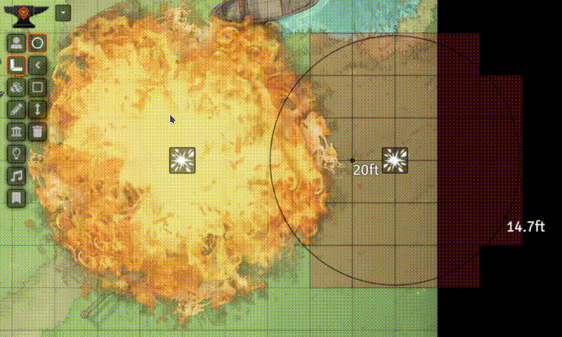
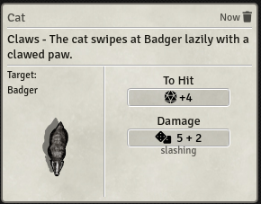
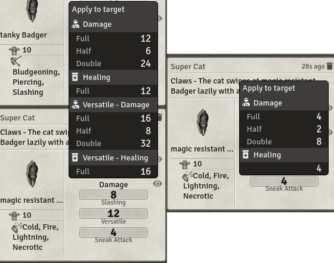
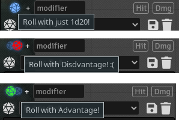
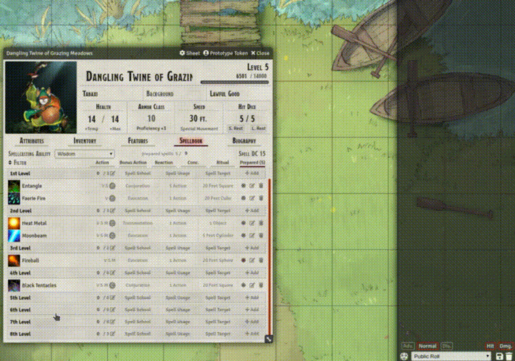
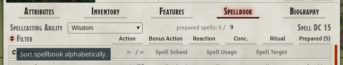
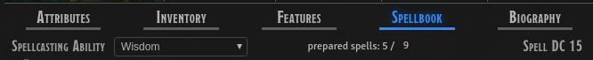

# Mess - Moerills enhancing super-suit(e)
      

This module is a mess!  
Just kidding! This module does not serve a more specific purpose, like most of my other modules, but is more of a growing collection of stuff, that:
* me or my player want for my game,
* quality of life improvements,
* things which i just found kinda interesting to play around with, but not worth their own module,
* proof of concepts.  

Settings allow to granularly dis-/enable features to your liking. *Important*: If you change the settings you need to refresh the page for all connected clients for the changes to take effect! (This may change in a future update, but currently it only works this way. Shouldn't be to bad, since you'd enable most features once and not change them mid session.)

## Current Feature List
- [Mess - Moerills enhancing super-suit(e)](#mess---moerills-enhancing-super-suite)
	- [Current Feature List](#current-feature-list)
- [Important Information!](#important-information)
	- [FVTT Version compatibility](#fvtt-version-compatibility)
	- [Module compatiblity](#module-compatiblity)
	- [Bug Reporting](#bug-reporting)
	- [Atribution](#atribution)
	- [Support the development](#support-the-development)
	- [Licensing](#licensing)
- [Universal Features](#universal-features)
	- [Template Changes](#template-changes)
		- [Scaling and animated template textures](#scaling-and-animated-template-textures)
		- [Hide grid highlight and border for textured templates](#hide-grid-highlight-and-border-for-textured-templates)
		- [Auto targetting on template move](#auto-targetting-on-template-move)
	- [Miscellaneous](#miscellaneous)
		- [Momentum based preview snapping](#momentum-based-preview-snapping)
		- [Drag and Drop animations for sorting lists](#drag-and-drop-animations-for-sorting-lists)
			- [Some important information and known issues for this feature](#some-important-information-and-known-issues-for-this-feature)
- [DnD5e specific features](#dnd5e-specific-features)
	- [Rolling and targeting change](#rolling-and-targeting-change)
		- [Custom attack and damage roll chat cards](#custom-attack-and-damage-roll-chat-cards)
			- [Extended tooltip](#extended-tooltip)
			- [GM only information](#gm-only-information)
			- [Always show GM attack card to players, but rolls only on demand](#always-show-gm-attack-card-to-players-but-rolls-only-on-demand)
			- [Custom flavor text](#custom-flavor-text)
			- [reactive context menu for applying dmg](#reactive-context-menu-for-applying-dmg)
		- [Autoroll and Advantage toggle](#autoroll-and-advantage-toggle)
		- [*Dice So Nice* Support](#dice-so-nice-support)
		- [Use items to add bonus damage to other items](#use-items-to-add-bonus-damage-to-other-items)
	- [Ability template textures](#ability-template-textures)
		- [Auto targeting with ability templates](#auto-targeting-with-ability-templates)
	- [Actor Sheet Changes](#actor-sheet-changes)
		- [Numerical scroller](#numerical-scroller)
		- [Alphabetical item sort](#alphabetical-item-sort)
		- [Prepared Spell Tracker](#prepared-spell-tracker)

# Important Information!
## FVTT Version compatibility
My focus is the FVTTs stable branch. I will neither promise nor prioritise updates for FVTTs beta or alpha branches! Feel free to report a bug so i know whats coming, but don't expect a fix before a stable FVTT update.

## Module compatiblity
This module is not designed to be compatible with most other modules, so incompatibilities may arise if some features are enabled. And i do not really care about compatibility with other modules for this Mess. (Also there are to many to keep track of now. Some parts of this mess are deep or very specific changes, that are to much work to make work with everything.)  
So be warned and carefully test the features without other modules enabled before submitting a bug report here!  

## Bug Reporting
Go to the [GitHub's issue board](https://github.com/Moerill/Mess/issues) and check if the Bug is already reported. If not first test with all other modules disabled! If the bug persists create a new issue, with at least the following information:
1. Module version
2. FVTT version
3. Browser and OS used. Or if the app itself is used.
4. Bug description
	- What happened?
	- What should've happened?
	- Console errors? (F12 or F11 in most browsers)
5. Workflow to recreate the bug
6. Helpful videos or screenshots if possible
7. Either activate notifications, stay active or post your discord handle so i can get back to you for further questions  

**I will only take a quick glance at half hearted bug reports or Discord mentions! Don't expect me to react there!**

## Atribution
Special thanks to:
* GitHub User @bsleys for his continued support on helping to enhance this module with features!
* Discord User @BrotherSharp for the japanese translation!
* Github User @rinnocento for the portuguese translation!
* @NickEast for his  which i'm using in a modified version for my building and publishing workflow.

This module would not be possible without the great work from Atropos on FoundryVTT and the [DnD5e System](https://gitlab.com/foundrynet/dnd5e) for FoundryVTT! Part of the code (especially the code for the rolls) is heavily based on the DnD5es code, which is licensed under GNU GPLv3.

The templates used in the videos are from [Pierluigi Riminis Perfect Spell Pack 2 animated](https://marketplace.roll20.net/browse/set/3954/perfect-spells-pack-2-animated).

## Support the development
I'm doing this project mostly alone (with partial help of some wonderful people mentioned above) in my spare time and for free.  
If you want to encourage me to keep doing this, i am happy about all kind of tokens of appreciation. (Like some nice words, recommending this project or even a small donation over at my [PayPal](https://www.paypal.com/cgi-bin/webscr?cmd=_s-xclick&hosted_button_id=FYZ294SP2JBGS&source=url)).  

## Licensing
Mess is licensed under the [LGPL v3](https://github.com/Moerill/Mess/blob/master/LICENSE).

This work is licensed under Foundry Virtual Tabletop [EULA - Limited License Agreement for module development](https://foundryvtt.com/article/license/).

# Universal Features

## Template Changes
### Scaling and animated template textures
  
Tired of FVTTs tiling for template textures? Then this feature is perfect for you! When this feature is enabled template textures are scaled up and rotated  to match the template. This also allows for the usage of video files as template textures! Nice! (For all textures the same rules as for all FVTT image and video files do apply)
This also automatically activates [Automatic Ability template texture](#ability-template-textures) when you're using the DnD5e system.

### Hide grid highlight and border for textured templates
  
When the template borders and grid highlights stand in the way of a fully immersive experience, use this feature to just hide them! This only hides borders and highlights for all _textured_ templates. If you want to make sure which grid squares are covered by the templates, just hover over it and the highlight and border will get displayed!

### Auto targetting on template move
Using this feature you automatically target each token inside a template you move around!  
Activating this feature also activates [Automatic template targeting for DnD5e](#auto-targeting-with-ability-templates).

## Miscellaneous

### Momentum based preview snapping

When moving placeables, like tiles or tokens, around you never know exactly where they end up, as long as grid snapping is enabled. This feature adds momentum based preview placement, to counter this issue!  
> "Uhm... Huh? I don't get it!"  

Let me explain: As long as you drag the placeable quickly around, the preview won't snap, but when you slow down the preview starts snapping to grid. (As long as you don't press the shiftKey to disable snapping).  
> "Why so complicated? Why not just always snap?"

To make dragging around more beautiful! Letting the placeable always snap, makes it kinda jumpy when dragging around, resulting in a less smooth and visually less appealing experience. Using the past momentum of the mouse, the algorithm notices when you slow down to precisely place a placeable, snapping it at the position it will really end up.  
*Imporant*: This feature still needs a bit fine tuning, adjusting the parameters, ... Feedback for this is valuable! You can provide feedback [here](https://github.com/Moerill/Mess/issues/1)

### Drag and Drop animations for sorting lists
  
Adds animations for Drag and Drop animations to make them more appealing to the eye and more obvious where stuff will end up when dropped.  
#### Some important information and known issues for this feature
1) Its supposed to work with all sidebar directories, that support a drag and drop workflow to sort.
	* Scene directory may look a bit odd (especially for scenes without thumbnails)
2) Many actor sheets are supported out of the box. Tested with:
	* DnD5e default and tidy5e sheets
	* Pf2e character sheet
  	* The container box may look a bit misleading..
3) sorting to the end of a list/folder is kinda difficult at the moment. For sidebar directories dragging onto the folder itself puts it at the end. (Trying to fix this just introduced quite a few more issues and was not worth the effort. Also to my knowledge its the same for base FVTT dragging)

# DnD5e specific features
## Rolling and targeting change
This is a big one and encompasses a variety of features.

### Custom attack and damage roll chat cards
  
(While this gif has not all the newest feature in, it does display the main features of the roll cards.)  
Default DnD5e does need way to many clicks, just to do a single attack. There do exist other approaches to handle this, like BetterRolls, but i am not a fan of those. This feature streamlines the process of attacking or using an item/feature/spell (from now on summarized together as ability).  
Each time you use an ability the default chat card gets created as well as an *attack card* for each target you selected (or just one if no target is selected or the ability is an AoE skill.). Example card:  
  
Hovering over the target in the card does highlight it on the map (if visible) and double clicking it pans it into view.  
If a crit is rolled the dmg formulas are automatically adjusted to respect it by using the double amount of dice.  
#### Extended tooltip
The dice tooltip (clicking on a result) now shows extended information. (Modifiers, proficiency bonus, ...)

#### GM only information
For all rolls  some extra information about the target will be shown:
* Armor Class
* Damage resistances
* Damage immunities
* Damage vulnerabilities

#### Always show GM attack card to players, but rolls only on demand
You can set to always ignore the roll mode set for the GM for attack cards only. This will always display basic information, like the attacker, chat flavor for the attack and the target (if existent). You then can decide to show your rolled attack or damage results to your players by clicking on the eye icon beside the section header. (Only the result will be shown to non GMs. Clicking on the result will not show extra information for players, like rolled dice, modifier, etc.)  
This has the advantage of easier tracking the flow of battle, targets and damage received for player characters. Also the players then can easily apply the damage received using the context menu to their characters.

#### Custom flavor text
The flavor text (in the example ``The cat swipes at Badger lazily with a clawed paw.``) is the chat flavor text specified for the item. If you want to display the targets name in it, use ``[target.name]`` inside the flavor text.  
*Rollable Tables as Flavor*: You can also specify to modify the flavor (partially) by adding a rollable table. You can do so similarly as you specify entity links everywhere else in FoundryVTT, by using ``@RollableTable[name]`` or ``@RollableTable[id]`` inside the chat flavor text. The module will automatically roll the table and replace the reference inside the flavor text. ``[target.name]`` will get replaced afterwards, so you can even use that inside your rollable tables.

#### reactive context menu for applying dmg
  
You can right click on a rolled dmg roll to select whether to apply dmg to the target of the chat card (or all selected tokens if the card has no target).  
Alternatively you can right click on the *Damage* header to automatically apply the sum of all rolled damage die. (Same rule as above for target) Also if versatile damage was rolled you can choose whether to use the versatile or the non versatile damage as main damage source.

### Autoroll and Advantage toggle
  
The roll change also adds options to toggle between *(dis-)advantage* and *normal* rolls, by clicking on the D20 above the chats roll mode selector. Right click will cycle through in the opposite direction. This will get applied at the time you click on the *to hit* button, not beforehand!  
This also adds a selection to choose if *to hit* or *damage* rolls should be rolled automatically on *attack card* creation.

### *Dice So Nice* Support
  
Automatically rolls *Dice So Nice* dice, when rolling.   
When autorolling it will always:
1) roll to Hit
2) all damage die together
3) Display Attack card
4) Repeat for next target
   
Of course it will also roll *Dice So Nice* dice for single rolls. Just click on the button and it will roll the dice. For each single die rolled it disables all other buttons on this attack card until the roll is completed and then updates the card.  

*Important*: The dice will respect the current selected roll mode and not how the card was send!

### Use items to add bonus damage to other items
Adds a new field to actor owned items to specify the first damage field as bonus damage for other damage rolls. Activating this will automatically add the damage to the list of damage rolls for each attack card off an item that is not bonus damage itself.  
There is an easy script macro command to toggle this for an item: ``game.mess.toggleItemBonusDamage('Item Name')``

## Ability template textures

Want to be cool and really show a fireball each time you cast it, instead of the blank template for targeting?  
This feature lets you specify textures for your templates automatically created by using a feature or spell. It adds to the item sheet a field to select an image or video file as texture. If no file is specified the module will automatically try to select a file depending on the settings set or blank if none found.  
**Important** This feature gets automatically activated when you activate [Scaling and animated template textures](#scaling-and-animated-template-textures) and are using the DnD5e system.

### Auto targeting with ability templates
This awesome template gets created when you cast a spell, but you still have to manually specify the tokens as targets? Uff! But i'm here to help: This feature automatically targets the tokens inside of your placed template.  
This doesn't do anything with the targets though, since, to my knowledge, RAW you roll only one dmg die for all AoE skills. So it only rolls *once* for AoE abilities, without a target, as seen in the GIF, in the previous section.

## Actor Sheet Changes
A collection of small actor sheet enhancements, mainly aimed at the default DnD 5e Actor sheet. Each of them can be dis-/enabled independently. These settings are also client side, so each user can decide for him-/herself if (s)he wants to use it.

### Numerical scroller
To lazy to use the keyboard to just reduce the hitpoints by just *1*? I got you covered! When enabling this feature you can click on a numerical field and use the mousewheel to de-/increase the value of the field!

### Alphabetical item sort
  
Keeping order is an ordeal! This feature adds a button that sorts all items of the current category alphabetically, so you don't have to!

### Prepared Spell Tracker
  
Always forget how many spells you're allowed to prepare? Fret not, this feature adds a field to the actor sheet to allow you to specify the maximum number of allowed prepared spells.
