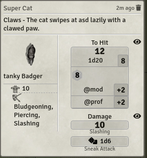

# Mess - Moerills enhancing super-suit(e)
    

This module is a mess!  
Just kidding! This module does not serve a more specific purpose, like most of my other modules, but is more of a growing collection of stuff, that:
* me or my player want for my game,
* quality of life improvements,
* things which i just found kinda interesting to play around with, but not worth their own module,
* proof of concepts.  

Settings allow to granularly dis-/enable features to your liking. *Important*: If you change the settings you need to refresh the page for all connected clients for the changes to take effect! (This may change in a future update, but currently it only works this way. Shouldn't be to bad, since you'd enable most features once and not change them mid session.)

## Current Feature List
- [System independent](#universal)
	* [Scaling and animated template textures](#scaling-and-animated-template-textures)
	* [Momentum based preview snapping](#momentum-based-preview-snapping)
- [DnD5e specific](#dnd5e-specific)
	* [More streamlined rolling and targeting](#rolling-and-targeting-change)
		- [Custom chat cards](#custom-attack-and-damage-roll-chat-cards)
		- [Autoroll and advantage toggles](#autoroll-and-advantage-toggle)
		- [Automatic Ability template texture](#ability-template-textures)
		- [Automatic template targeting](#auto-targeting-with-ability-templates)
	* [Actor sheet changes](#actor-sheet-changes)
		- [Numerical scroller](#numerical-scroller)
		- [Sort items alphabetically](#alphabetical-item-sort)
		- [Prepared spell tracker](#prepared-spell-tracker)

# Important Information!
## FVTT Version compatibility
My focus is the FVTTs stable branch. I will neither promise nor prioritise updates for FVTTs beta or alpha branches! Feel free to report a bug so i know whats coming, but don't expect a fix before a stable FVTT update.

## Module compatiblity
This module is not designed to be compatible with most other modules, so incompatibilities may arise if some features are enabled. And i do not really care about compatibility with other modules for this Mess. (Also there are to many to keep track of now. Some parts of this mess are deep or very specific changes, that are to much work to make work with everything.)  
So be warned and carefully test the features without other modules enabled before submitting a bug report here!  

## Bug Reporting
Go to the [GitHub's issue board](https://github.com/Moerill/Mess/issues) and check if the Bug is already reported. If not first test with all other modules disabled! If the bug persists create a new issue, with at least the following information:
1. Module version
2. FVTT version
3. Browser and OS used. Or if the app itself is used.
4. Bug description
	- What happened?
	- What should've happened?
	- Console errors? (F12 or F11 in most browsers)
5. Workflow to recreate the bug
6. Helpful videos or screenshots if possible
7. Either activate notifications, stay active or post your discord handle so i can get back to you for further questions  

**I will only take a quick glance at half hearted bug reports or Discord mentions! Don't expect me to react there!**

## Atribution
Thanks to @NickEast for his  which i'm using in a modified version for my building and publishing workflow.

The templates used in the videos are from [Pierluigi Riminis Perfect Spell Pack 2 animated](https://marketplace.roll20.net/browse/set/3954/perfect-spells-pack-2-animated).

## Licensing
Mess is licensed under the [LGPL v3](https://github.com/Moerill/Mess/blob/master/LICENSE).

This work is licensed under Foundry Virtual Tabletop [EULA - Limited License Agreement for module development](https://foundryvtt.com/article/license/).

## Support the development
Want to help me develop? Send a merge request on this gitlab or contact me on Discord (Moerill#7205).  
Want to support me in another way? 
Leave me some nice comments (e.g. on Discord), recommend this module to others and/or leave a donation over at my [PayPal](https://www.paypal.com/cgi-bin/webscr?cmd=_s-xclick&hosted_button_id=FYZ294SP2JBGS&source=url).

# Features

## Universal
### Scaling and animated template textures
  
Tired of FVTTs tiling for template textures? Then this feature is perfect for you! When this feature is enabled template textures are scaled up and rotated  to match the template. This also allows for the usage of video files as template textures! Nice! (For all textures the same rules as for all FVTT image and video files do apply)
This also automatically activates [Automatic Ability template texture](#ability-template-textures) when you're using the DnD5e system.

### Momentum based preview snapping

When moving placeables, like tiles or tokens, around you never know exactly where they end up, as long as grid snapping is enabled. This feature adds momentum based preview placement, to counter this issue!  
> "Uhm... Huh? I don't get it!"  

Let me explain: As long as you drag the placeable quickly around, the preview won't snap, but when you slow down the preview starts snapping to grid. (As long as you don't press the shiftKey to disable snapping).  
> "Why so complicated? Why not just always snap?"

To make dragging around more beautiful! Letting the placeable always snap, makes it kinda jumpy when dragging around, resulting in a less smooth and visually less appealing experience. Using the past momentum of the mouse, the algorithm notices when you slow down to precisely place a placeable, snapping it at the position it will really end up.  
*Imporant*: This feature still needs a bit fine tuning, adjusting the parameters, ... Feedback for this is valuable! You can provide feedback [here](https://github.com/Moerill/Mess/issues/1)

## DnD5e specific
### Rolling and targeting change
This is a big one and encompasses a variety of features.

#### Custom attack and damage roll chat cards
  
Default DnD5e does need way to many clicks, just to do a single attack. There do exist other approaches to handle this, like BetterRolls, but i am not a fan of those. This feature streamlines the process of attacking or using an item/feature/spell (from now on summarized together as ability).  
Each time you use an ability the default chat card gets created as well as an *attack card* for each target you selected (or just one if no target is selected or the ability is an AoE skill.). Example card:  
  
Hovering over the target in the card does highlight it on the map (if visible) and double clicking it pans it into view.  
If a crit is rolled the dmg formulas are automatically adjusted to respect it by using the double amount of dice.  
The flavor text (in the example ``The cat swipes at Badger lazily with a clawed paw.``) is the chat flavor text specified for the item. If you want to display the targets name in it, use ``[target.name]`` inside the flavor text.

#### Autoroll and Advantage toggle
  
The roll change also adds options to toggle between *(dis-)advantage* and *normal* rolls, by clicking on the D20 above the chats roll mode selector. Right click will cycle through in the opposite direction. This will get applied at the time you click on the *to hit* button, not beforehand!  
This also adds a selection to choose if *to hit* or *damage* rolls should be rolled automatically on *attack card* creation.

### Ability template textures

Want to be cool and really show a fireball each time you cast it, instead of the blank template for targeting?  
This feature lets you specify textures for your templates automatically created by using a feature or spell. It adds to the item sheet a field to select an image or video file as texture. If no file is specified the module will automatically try to select a file depending on the settings set or blank if none found.  
**Important** This feature gets automatically activated when you activate [Scaling and animated template textures](#scaling-and-animated-template-textures) and are using the DnD5e system.

#### Auto targeting with ability templates
This awesome template gets created when you cast a spell, but you still have to manually specify the tokens as targets? Uff! But i'm here to help: This feature automatically targets the tokens inside of your placed template.  
This doesn't do anything with the targets though, since, to my knowledge, RAW you roll only one dmg die for all AoE skills. So it only rolls *once* for AoE abilities, without a target, as seen in the GIF, in the previous section.

### Actor Sheet Changes
A collection of small actor sheet enhancements, mainly aimed at the default DnD 5e Actor sheet. Each of them can be dis-/enabled independently. These settings are also client side, so each user can decide for him-/herself if (s)he wants to use it.

#### Numerical scroller
To lazy to use the keyboard to just reduce the hitpoints by just *1*? I got you covered! When enabling this feature you can click on a numerical field and use the mousewheel to de-/increase the value of the field!

#### Alphabetical item sort
  
Keeping order is an ordeal! This feature adds a button that sorts all items of the current category alphabetically, so you don't have to!

#### Prepared Spell Tracker
  
Always forget how many spells you're allowed to prepare? Fret not, this feature adds a field to the actor sheet to allow you to specify the maximum number of allowed prepared spells.
